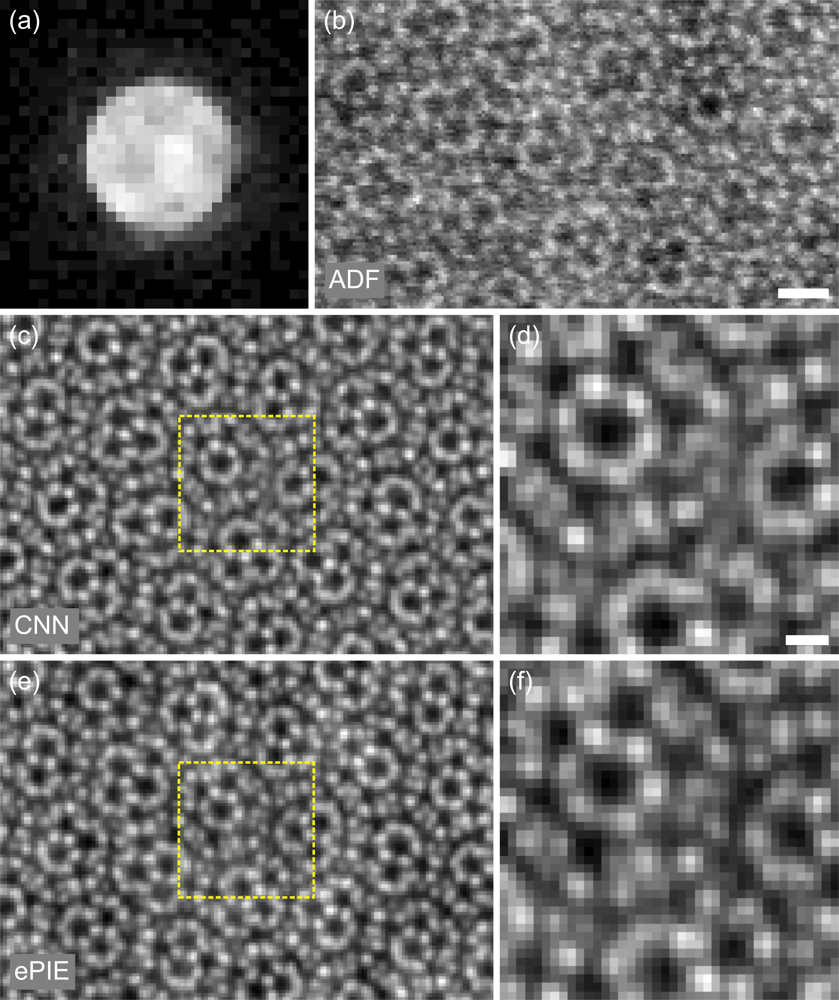
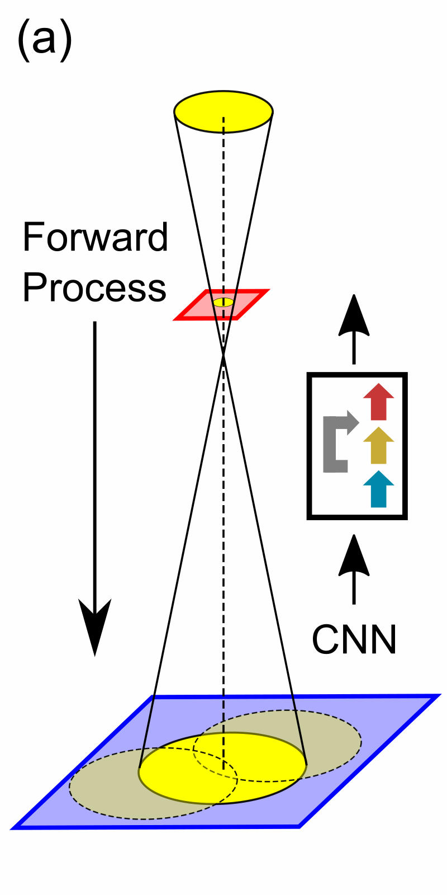
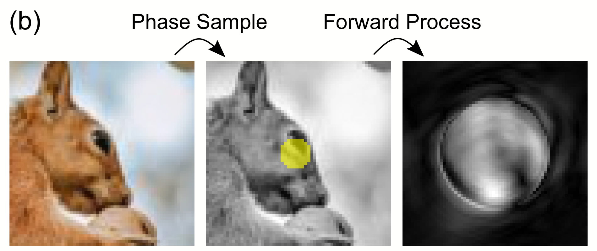
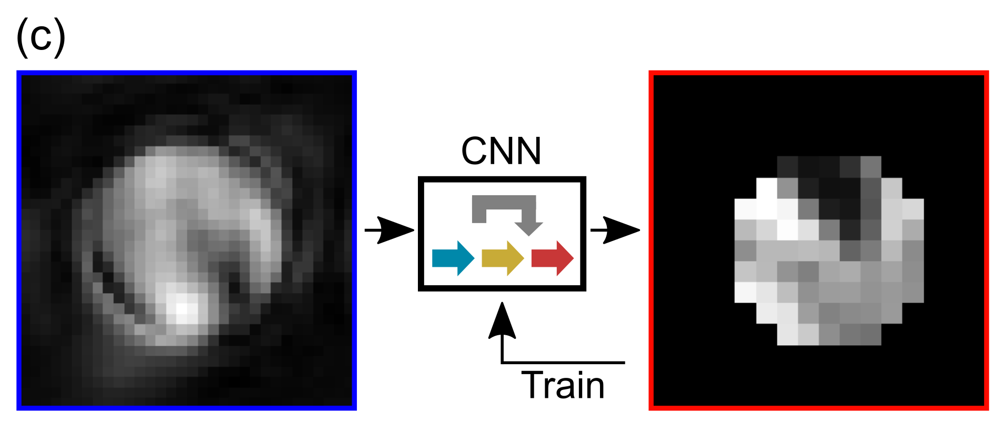
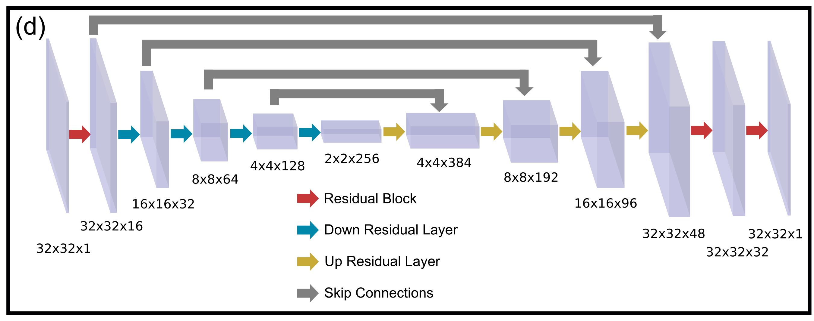
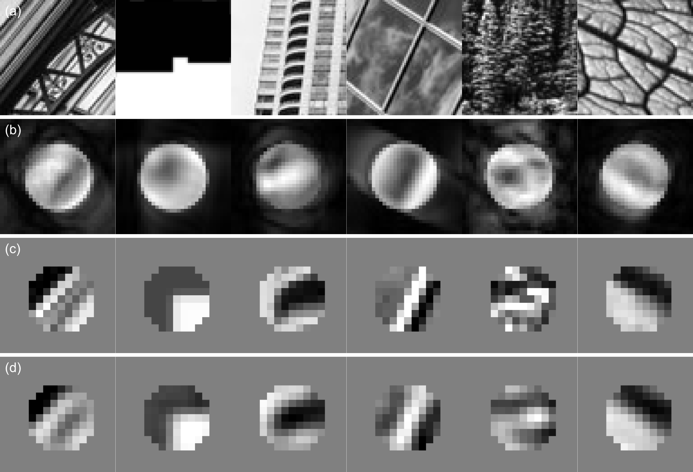
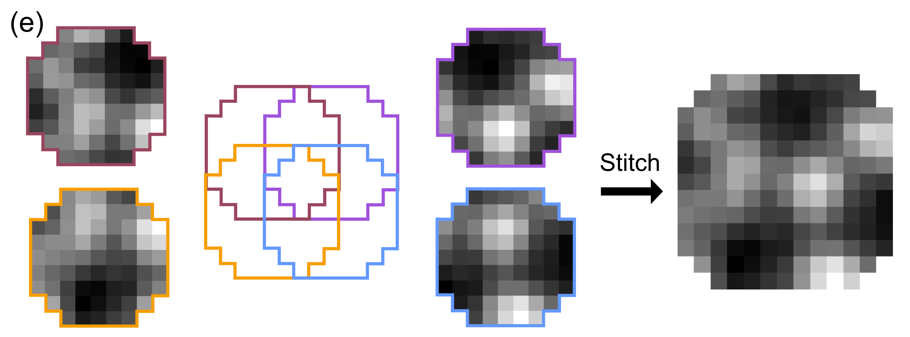
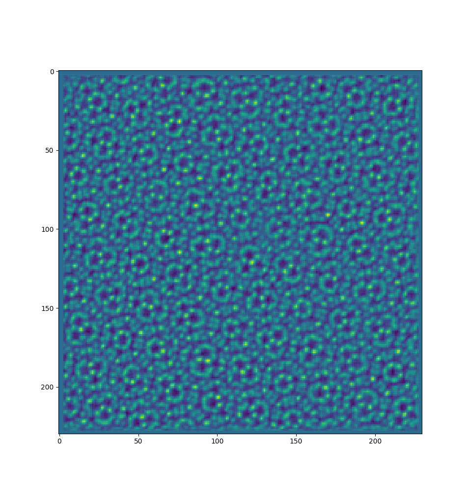

# Deep Learning Electron Diffractive Imaging

This repository is a tutorial for training a convolutional neural network (CNN)
that can perform end-to-end electron phase imaging from 4D STEM diffraction
data. This tutorial contains experimental hexagonal Boron Nitride (hBN) 4D data
as an example. A detailed manuscript for this project can be found
[here](https://journals.aps.org/prl/abstract/10.1103/PhysRevLett.130.016101).

If there are issues with downloading the input files from LFS, the input files can be found [here](https://drive.google.com/drive/folders/12nNB5n-v5GIBEmmBy7JW9ob3wYYL63tj?usp=sharing).

<p align="center">
  </center>
</p>

# Installation

This package has been developed and tested on Python 3.7. We recommend using
[conda](https://docs.conda.io/en/latest/) or [Python's virtual
environments](https://docs.python.org/3/library/venv.html) for keeping
dependencies separate from your system Python installation, such as 

```shell
conda create -n deep-cdi python=3.7
conda activate deep-cdi
```

```shell
python3 -m venv venv
source venv/bin/activate
```

Necessary packages for running the source codes can be installed using

```shell
python -m pip install numpy scipy pandas h5py image matplotlib==2.2.5 tensorflow-gpu==2.3.0
```

# Introduction

The method of deep learning phase imaging with augmented data begins with the
forward propagation of a coherent source after illuminating an object. The
resulting wave function is propagated to the Fraunhofer regime and only the
square of the amplitude of the wave function is measured by a pixel array
detector. We will attempt to find the inverse of this forward process via a
convolutional neural network.
<p align="center">
  </center>
</p>

Mathematically, this forward process relates the object function and the
measurement by

$$M(k)=\left| F( P(r) \cdot O(r) ) \right|$$

where $M(k)$ is the amplitude of the Fourier transform $(F)$, $P(r)$ and $O(r)$
are the complex probe and object function, respectively. Since the phase of the
Fourier transform is lost during measurement, the inverse of this forward
process is nonlinear. Furthermore, noise from counting statistics and detectors
corrupts the measurements, rendering the inverse process difficult.  

# Training Neural Network
Executing
```shell
python 0_train-cnn/train_cnn.py
```
will begin training the neural network, taking a probe function and a database
of random stock images as inputs.

We can generate an augmented training set by converting a random stock image
found on the internet into a pure phase object, and illuminating it by the probe
function to produce an exit wave.
<p align="center">
  </center>
</p>

The square root of the noisy diffraction intensity was used to train CNNs with
an L1-norm loss function to recover the phases in the illuminated area. This
illuminated area is created and stored in `./0_train-cnn/output/mask.npy`.
<p align="center">
  </center>
</p>
<p align="center">
  </center>
</p>

In our experience, using randomly generated stock photos from the internet
provided a rich source of entropy within the images to sufficiently train the
CNNs without imposing any regularizations. More examples of phase image
generation, forward process and CNN performance on validation data can be found
below:
<p align="center">
  </center>
</p>

The trained CNN can now be used to directly map from the amplitudes of the
Fourier transform to phase patches without any iterative methods. During the
training process, weights at every iteration are stored as
`./0_train-cnn/output/weights/XXX.hdf5`.

# Predicting Phase Images and Stitching
Run
```shell
python 1_phase-recon/phase_recon.py
```
to perform phase reconstruction from experimental hBN 4D STEM data using one of
the trained weights from the procedure above (taken at 20th iteration).

As the zero frequency of the phase is irrecoverable from the CNN, two adjacent
recovered phases differ in the overlapped region by an overall phase shift.
Therefore, a stitching method was developed to tile the phase patches to form a
phase image. 
<p align="center">
  </center>
</p>

The implementation of the algorithm can be found in `phase_recon.py`, and a
well-stitched phase image usually requires only a few iterations.
```python
def stitch(objs_pred,pos,mask,num_iter,alpha):
  mask_1d = mask.reshape((mask.shape[0]*mask.shape[1],1)).astype(bool)
  pos_r   = np.round(pos).astype('int')
  obj     = np.zeros((np.max(pos_r[:,0])+objs_pred.shape[1]+1,np.max(pos_r[:,1])+objs_pred.shape[2]+1))
  idxs    = list(range(objs_pred.shape[0]))
  np.random.shuffle(idxs)
  for i in range(0,NUM_ITER):
    for idx in range(0,objs_pred.shape[0]):
      p = idxs[idx]
      x = pos_r[p,0]
      y = pos_r[p,1]
      a = obj[x:x+objs_pred.shape[1],y:y+objs_pred.shape[2]]
      a_1d = a.reshape((mask.shape[0]*mask.shape[1],1))
      a_mean = np.mean(a_1d[mask_1d])
      b = objs_pred[p,:,:]
      obj_diff = ALPHA*(b-a+a_mean)*mask
      a = a + obj_diff
      obj[x:x+objs_pred.shape[1],y:y+objs_pred.shape[2]] = a
  return obj
```

# Results
After `phase_recon.py` completes, a stitched reconstruction of hBN will appear
and be stored in `./1_phase-recon/output/recon.npy`.
<p align="center">
  </center>
</p>

